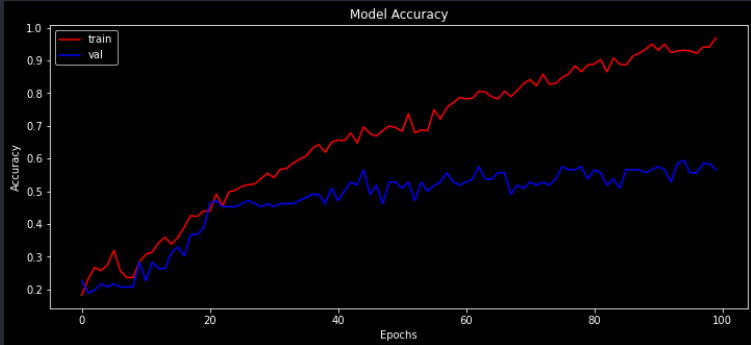

Certainly, here's a shorter version of the content:

---

# Dog Breed Prediction

## Overview

This project utilizes TensorFlow and Keras to train a convolutional neural network for predicting dog breeds. It involves the following steps:

1. Dataset Loading: The dataset is obtained from Kaggle (750MB in size).
2. Label Handling: Labels containing image IDs and breeds are loaded from a CSV file.
3. Data Preprocessing: The dataset is checked for breed counts, and one-hot encoding is applied to the labels' prediction column.
4. Image Processing: Images are loaded, converted to arrays, and normalized.
5. Data Inspection: The shape and size of the data (X and Y) are examined.
6. Model Creation: A neural network architecture is defined.
7. Data Splitting: The data is split and fitted into the model to create accuracy points.
8. Model Evaluation: The model's accuracy score is calculated.
9. Prediction: The trained model is used for breed prediction.

## Requirements

- Python
- NumPy
- Pandas
- Jupyter Notebook (optional)
- Anaconda (if not using requirements.txt)

## Execution

This project's execution time may vary but typically takes around 1 hour depending on your computer's performance.

## Accuracy Graph

## Output

This project showcases the use of TensorFlow and Keras to predict dog breeds, demonstrating the power of deep learning in image classification tasks.

---

This condensed version of the content captures the essence of the Dog Breed Prediction project while maintaining brevity.